
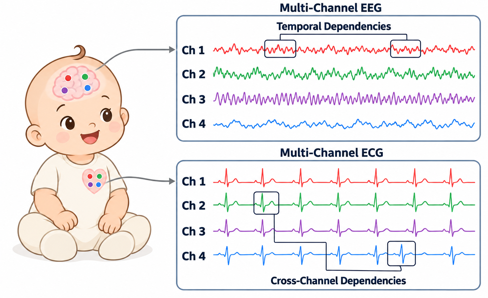
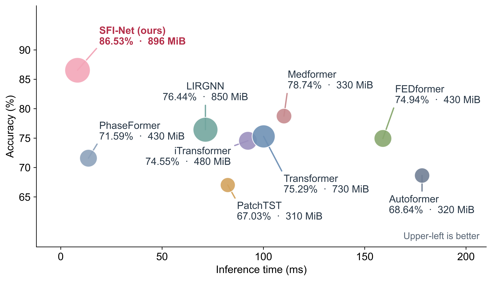
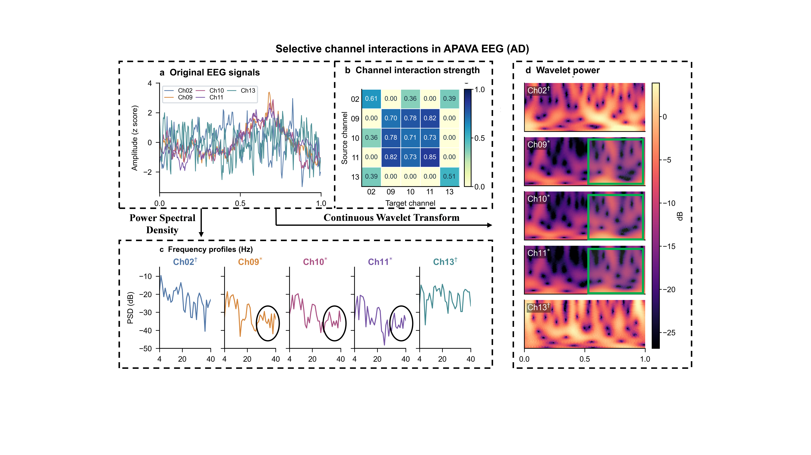
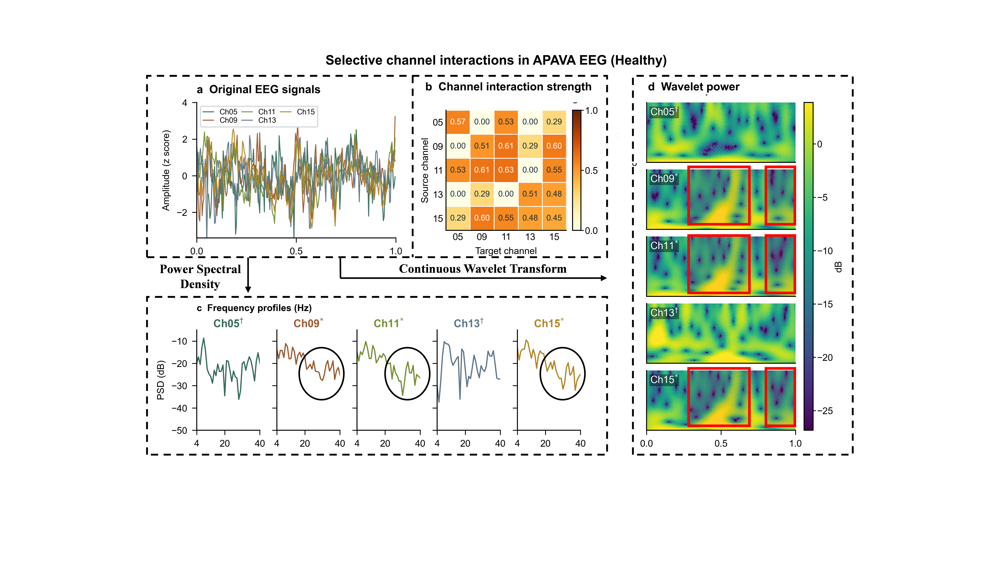
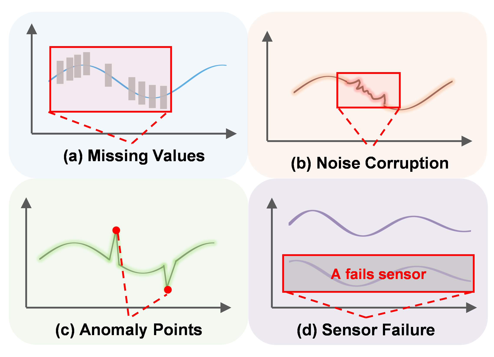

<div align="center">

# SFI-Net: A Spatiotemporal Flexible Interaction Network for Medical Time-Series Classification

**Selective cross-channel communication across time — without forcing every channel pair to interact.**

[](#scope-of-this-release)
[](#method-at-a-glance)
[](#data-preparation)



<sub>Conceptual overview: channel-independent (CI), channel-dependent (CD), and SFI interactions.</sub>

<p align="center">
  
</p>
<p align="center"><sub>Medical signal overview: multichannel EEG and ECG sequences with within-channel temporal structure and cross-channel dependencies.</sub></p>

</div>

## Method at a glance

```text
Multivariate signal [B, T, C]
        │
        ├─ Per-channel patching + shared temporal Transformer
        │
        └─ Channel–patch tokens [B, C×P, D]
                    │
             Sample-specific sparse Top-k graph
                    │
        Shared spectral basis + learnable soft bands
                    │
          Band-specific graph interaction
                    │
          Node-gated band fusion → classifier
```

The implementation keeps the temporal encoder channel-independent and introduces cross-channel interaction in the channel–patch graph stage. The graph uses cosine similarity with Top-*k* neighbors; Low/Mid/High spectral responses are softly assigned and fused with node-wise gates. See [`models/Ours.py`](models/Ours.py) for the implementation and [`experiments/ours_trainer.py`](experiments/ours_trainer.py) for training and evaluation.

## Main results preview

Selected subject-independent results from the project's updated baseline table (mean ± standard deviation, %, five runs):

| Dataset | Accuracy | Macro-F1 | AUROC |
|---|---:|---:|---:|
| APAVA | **86.53 ± 0.75** | **86.33 ± 0.68** | **94.60 ± 0.40** |
| ADFTD | **55.89 ± 0.49** | 50.27 ± 1.10 | **70.14 ± 0.68** |

<p align="center">
  
</p>
<p align="center"><sub>APAVA efficiency comparison from the project figure assets. It is included as a visual result summary, not generated by the bundled training runner.</sub></p>

## Visual examples

Representative channel-interaction and time–frequency visualizations from APAVA are shown below. These are **illustrative examples**, not outputs regenerated by the minimal runner in this folder.

<table>
  <tr>
    <td align="center" width="50%"><br><sub>APAVA — AD example</sub></td>
    <td align="center" width="50%"><br><sub>APAVA — healthy example</sub></td>
  </tr>
</table>

<p align="center">
  
</p>
<p align="center"><sub>Robustness-setting illustration from the broader project materials; robustness experiment code is intentionally outside this release.</sub></p>

## Setup

Python 3.10 is recommended. Install a PyTorch build compatible with your CUDA setup if using a GPU, then install the remaining pinned dependencies:

```bash
pip install -r requirements.txt
```

The runner uses CUDA by default when available. To explicitly allow CPU execution, add `--allow-cpu`.

## Data preparation

**No data are distributed in this repository.** Obtain and preprocess each dataset according to its source and the protocol used by the project. Place the resulting files in the expected structure:

```text
datasets/
├── APAVA/
│   └── APAVA/
│       ├── Feature/feature_<subject_id>.npy
│       └── Label/label.npy
└── ADFTD/
    └── ADFD/
        ├── Feature/feature_<subject_id>.npy
        └── Label/label.npy
```

The default paths point to `./datasets/APAVA` and `./datasets/ADFTD`. Each feature file is expected to contain a `[windows, time, channels]` NumPy array; `label.npy` stores subject labels and IDs. Dataset directories are excluded by [`.gitignore`](.gitignore).

## Run the main experiments

From this directory, run the default five-seed APAVA experiment:

```bash
python run_ours.py --dataset APAVA
```

Run ADFTD, or both supported datasets:

```bash
python run_ours.py --dataset ADFTD
python run_ours.py --dataset all
```

To use data or output locations elsewhere:

```bash
python run_ours.py \
  --dataset APAVA \
  --apava-root /path/to/dataset-parent \
  --output-root ./outputs \
  --seeds 42 43 44 45 46
```

The output directory contains run arguments, per-seed checkpoints and metrics, split manifests, aggregate metrics, and diagnostic arrays. Dataset-specific default training settings and the subject-level split logic are kept in the source so the run configuration is inspectable.

## Repository layout

```text
SFI-Net/
├── assets/                    # Curated project figures for this README
├── experiments/
│   ├── ours_data.py            # Dataset loading and subject-wise splits
│   └── ours_trainer.py         # Training, evaluation, diagnostics, export
├── layers/
│   └── Augmentation.py         # Training-time signal augmentations
├── models/
│   └── Ours.py                 # SFI-Net architecture (legacy class name: Ours)
├── requirements.txt
└── run_ours.py                # Main APAVA / ADFTD entry point
```

## License and attribution

This folder does not yet include a license. **A public repository without an explicit license does not grant permission to reuse the code.** Before publishing, confirm the licensing/provenance of the included augmentation implementation and add the license chosen by the project owners. No dataset files or dataset redistribution rights are included here.

The augmentation module was carried over from the project's existing TeCh code tree. The inspected source did not include an upstream license, so its redistribution terms have not yet been confirmed. This release does not include a license file; reuse is not granted unless an explicit license is added.
